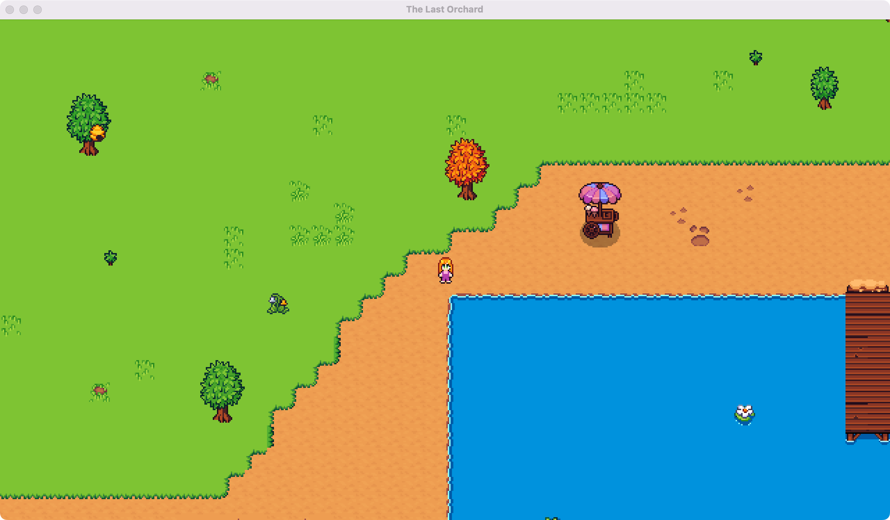

# The Last Orchard 🍎✨

Ever wondered what it's like to build a game from scratch? Me too. This is my exploration into 2D pixel art game development using Kotlin and libGDX.

## What's This?

A tiny farm simulator where you (eventually) grow crops, tend orchards, and maybe pet a chicken or two. 🐔 Right now, you can walk around a grassy map with some water and trees. The character can't walk through solid obstacles and water, which is more exciting than it sounds. 🤠

## What I'm Learning

🎮 **Game loops** - Update, render, repeat (60 times per second)  
🗺️ **Tile-based worlds** - Painting maps in Tiled, rendering them efficiently  
⚡ **Real-time physics** - Delta time, velocity, vector math
💥 **Collision detection** - Collision with Tiled object layers
🎨 **Asset pipelines** - Loading textures, handling spritesheets, async coroutines  
📦 **Pragmatic architecture** - Not Clean Architecture, but clean *enough*  
🐛 **Debug tooling** – Runtime toggles, build configurations   

## Tech Stack

- **Kotlin** (because of course)
- **[libGDX](https://libgdx.com/)** + **[KTX](https://libktx.github.io/)** – Kotlin-first game framework
- **Tiled** (map editor)
- **Gradle** (build system)

## Current State

You can press WASD to walk around. The camera follows you. Collision detection prevents you from walking through trees and drowning in water. Thrilling, I know. 😅 Press F4 to see debug collision boxes.

More features coming as I figure out animations and NPCs.

## Running the Game

**Quick start:**

./gradlew lwjgl3:run

**Debug mode (with collision boxes visible by default):**

./gradlew lwjgl3:runDebug

**Build a runnable JAR:**

./gradlew lwjgl3:jar
(located at lwjgl3/build/libs/)

**Other useful commands:**
- `./gradlew build` – Build all projects
- `./gradlew clean` – Remove build folders
- `./gradlew idea` – Generate IntelliJ project files
- `./gradlew test` – Run unit tests

On Windows, use `gradlew.bat` instead of `./gradlew`.

## Project Structure

- **core** – Main game logic (cross-platform)
- **lwjgl3** – Desktop launcher using LWJGL3

Tested on macOS. Should work anywhere Java runs.

## Asset Credits

This project uses pixel art assets by **[EmanuelleDev](https://emanuelledev.itch.io/)**.

---

*Not a real game (yet?). Just me poking around outside my usual Android app comfort zone.*
